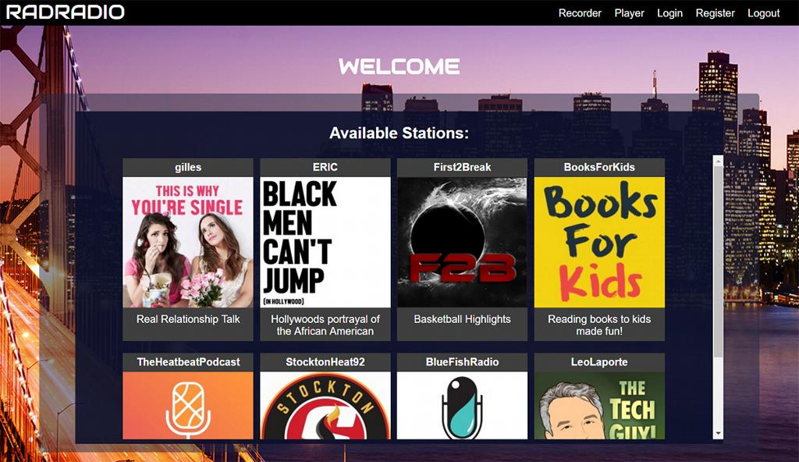

# Project Name

Medium for Radio

radrad.io is a audio recording and listening service through which anyone can easily set up a live radio stream and broadcast to the world instantly. Users are able to live broadcast instantaneously, while also recording their streams for future listening. Listeners are able to message broadcasters as they broadcast live, creating instant feedback for the broadcasters. 



## Team

  - __Product Owner__: Eric Eakin
  - __Scrum Master__: Eugene Choe
  - __Development Team Members__: JP Zivalich, Gilles Bouvier

## Usage

```sh
npm start // starts nodemon express/ssl server
webpack-watch // starts webpack module manager for dependencies
mongod // starts mongodb server
```

## Requirements

- node.js / express
- mongoDB

## Development

### Installing Dependencies

From within the root directory:

```sh
sudo npm install -g bower
npm install
bower install
```